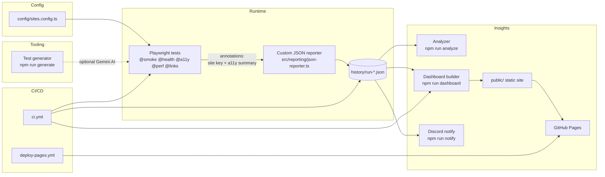
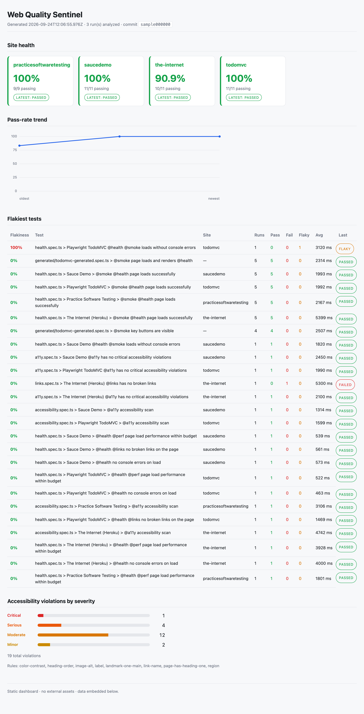

# Web Quality Sentinel

> Continuous web-quality monitoring for real, public websites — load, console errors, broken links, performance budgets and accessibility — with flakiness tracking, a trends dashboard, and an AI-optional test generator, all wired into CI/CD.


---

## Overview

**Web Quality Sentinel** is a small platform that treats "is the web healthy?" as a testable, trendable question. Instead of a bag of one-off scripts, it runs a Playwright test suite against a curated list of public websites on every push and on a daily schedule, capturing page-load success, console errors, broken links, a performance budget, and accessibility violations for each site.

Every run is recorded. A custom Playwright reporter serializes a structured summary of each run to `history/run-*.json`, and those files are committed back to the repository so the signal persists across CI runs. On top of that history sits an analyzer that computes flakiness statistics and a static dashboard that visualizes trends over time, published to GitHub Pages.

The project is deliberately shaped like a real product: three cooperating modules (a **Health Monitor**, a **Flakiness Tracker & Dashboard**, and a **Test Generator**), a strict shared type contract, cross-browser and mobile coverage, and a full CI/CD pipeline. It is meant to be both genuinely useful for watching a set of sites and a portfolio-quality demonstration of test architecture, reporting, and automation.

## Features

### Health Monitor

- Iterates the sites in [`config/sites.config.ts`](config/sites.config.ts) — adding a site is a one-line change and it is instantly covered by every check.
- **Load & console checks** — verifies pages load and watches for console errors (`@health`, `@smoke`).
- **Broken-link checks** — status-checks on-page links up to a configurable cap, with per-site `ignoreLinkPatterns` for known-bad demo links (`@links`).
- **Performance budget** — flags pages that exceed a configurable load-time threshold, overridable per site via `perfThresholdMs` (`@perf`).
- **Accessibility scans** — runs axe-core and reports violations by severity, attached to each run as structured data (`@a11y`).
- **Cross-browser + mobile** — every check runs on Chromium, Firefox, WebKit and Mobile Chrome projects.

### Flakiness Tracker & Dashboard

- A **custom Playwright reporter** ([`src/reporting/json-reporter.ts`](src/reporting/json-reporter.ts)) writes one `RunSummary` per run into `history/run-*.json`, using test annotations as a side-channel for site keys and accessibility summaries.
- **Committed history** — run summaries are pushed back to the repo by CI so trends accumulate rather than vanish with the runner.
- **Flakiness analysis** — `npm run analyze` reads all history and prints stability/flakiness statistics (retries that eventually pass are a flaky signal).
- **Trends dashboard** — `npm run dashboard` builds a self-contained static site into `public/`, deployed to GitHub Pages.
- **Discord notifications** — `npm run notify` posts a run summary to a Discord webhook when configured.

### Test Generator

- `npm run generate -- --url <url>` scaffolds a Playwright test for a given URL.
- **Template-first, AI-optional** — produces a deterministic template out of the box; when `GEMINI_API_KEY` is set it enriches the generated test with AI-authored cases, and falls back gracefully to the template if the key is absent.

## Architecture



## Tech stack

- **Playwright** (`@playwright/test`) — test runner, cross-browser + mobile projects, HTML report.
- **TypeScript** (strict) — end-to-end typed shared contract in `src/types.ts`.
- **axe-core** (`@axe-core/playwright`) — accessibility scanning.
- **tsx** — runs the ESM analyzer/dashboard/generator/notify scripts directly.
- **ESLint + Prettier** — linting and formatting.
- **Node.js 20** — runtime.
- **GitHub Actions** — CI/CD, artifacts, and GitHub Pages deployment.
- **Discord webhooks** — optional run notifications.
- **Google Gemini** (optional) — AI-enhanced test generation.

## Project structure

```
web-quality-sentinel/
├── config/
│   ├── sites.config.ts        # The list of sites to monitor (edit here to add sites)
│   └── env.ts                 # Typed environment/config accessors
├── src/
│   ├── types.ts               # Shared types & annotation-type constants
│   ├── monitors/              # Health Monitor helpers (load, links, perf, a11y)
│   ├── reporting/             # Custom Playwright reporter -> history JSON
│   ├── dashboard/             # analyze.ts, build.ts, notify.ts
│   └── generator/             # cli.ts — template + optional-AI test generator
├── tests/                     # Playwright specs, tagged @smoke/@health/@a11y/@perf/@links
├── history/                   # Committed run-*.json summaries (trend data)
├── public/                    # Generated static dashboard (deployed to Pages)
├── docs/screenshots/          # README screenshots
└── .github/workflows/
    ├── ci.yml                 # Lint, type-check, monitor, publish, commit history
    └── deploy-pages.yml       # Build dashboard & deploy to GitHub Pages
```

## Getting started

**Prerequisites**

- Node.js 20+
- npm

**Install**

```bash
npm install
npx playwright install
cp .env.example .env   # optional — the project runs fully with no env vars set
```

All environment variables are optional; see [Configuration](#configuration) below.

## Usage

### Health Monitor

```bash
# Run the full monitor suite across all sites and browser projects
npm test

# Run only the fast smoke checks
npm run test:smoke

# Run only the accessibility scans
npm run test:a11y

# Run only the health (load/console) checks
npm run test:health

# Open the last HTML report
npm run report
```

### Flakiness Tracker & Dashboard

```bash
# Print flakiness / stability statistics from committed history
npm run analyze

# Build the static trends dashboard into public/
npm run dashboard

# Post a run summary to Discord (requires DISCORD_WEBHOOK_URL)
npm run notify
```

### Test Generator

```bash
# Deterministic template-based generation
npm run generate -- --url https://example.com

# AI-enhanced generation (set GEMINI_API_KEY in your environment first)
GEMINI_API_KEY=your_key npm run generate -- --url https://example.com
```

## How to add a site

Append one object to the `sites` array in [`config/sites.config.ts`](config/sites.config.ts):

```ts
{ key: 'example', name: 'Example', url: 'https://example.com', tags: ['marketing'] },
```

Every monitor test iterates this array, so the new site is automatically covered by the load, console-error, broken-link, performance and accessibility checks. Optional fields: `perfThresholdMs` (per-site performance budget) and `ignoreLinkPatterns` (skip known-bad links).

## CI/CD

Two GitHub Actions workflows drive the pipeline:

**`.github/workflows/ci.yml`** — runs on push to `main`, on pull requests, on a daily schedule (`0 6 * * *`), and via manual dispatch. It:

1. Checks out, sets up Node 20 with npm caching, and caches the Playwright browser download (keyed on the resolved Playwright version).
2. Runs `npm ci`, `npm run lint`, `npm run typecheck`.
3. Runs `npm test`. Because the suite monitors **external** sites, the test step is `continue-on-error` — a transient third-party outage should not block publishing the report and history that record it. The real outcome is surfaced as a warning at the end of the job.
4. Uploads the Playwright HTML report (`playwright-report/`) as an artifact with `always()`.
5. Rebuilds the dashboard (`npm run dashboard`).
6. On non-PR events, commits updated `history/` back to the repo (`chore: update run history [skip ci]`) under a bot identity, so trend data persists. Pull requests (including forks) never push.
7. Posts to Discord via `npm run notify` when `DISCORD_WEBHOOK_URL` is set.

**`.github/workflows/deploy-pages.yml`** — deploys `public/` to GitHub Pages. It runs after CI completes on `main` (`workflow_run`), on push to `main`, and via manual dispatch. It builds the dashboard with `npm ci` + `npm run dashboard` (no browsers needed since it only reads committed history), then publishes with `configure-pages` → `upload-pages-artifact` → `deploy-pages`, using `pages: write` / `id-token: write` permissions and a `pages` concurrency group.

**Enabling this in your repo:**

- **Settings → Pages → Build and deployment → Source: GitHub Actions.**
- **Settings → Actions → General → Workflow permissions: Read and write permissions** (so CI can commit history).
- Optionally add repository secrets: `DISCORD_WEBHOOK_URL` and `GEMINI_API_KEY`.

## Configuration

All variables are optional. Copy `.env.example` to `.env` (locally) or set them as GitHub Secrets (in CI).

| Variable                | Default            | Description                                                                                            |
| ----------------------- | ------------------ | ------------------------------------------------------------------------------------------------------ |
| `PERF_THRESHOLD_MS`     | `4000`             | Page-load performance budget in milliseconds.                                                          |
| `MAX_LINKS_PER_PAGE`    | `20`               | Max links to status-check per page (keeps runs fast and polite).                                       |
| `LINK_CHECK_TIMEOUT_MS` | `10000`            | Per-link request timeout in milliseconds.                                                              |
| `DISCORD_WEBHOOK_URL`   | _(unset)_          | If set, `npm run notify` posts a run summary to this webhook.                                          |
| `GEMINI_API_KEY`        | _(unset)_          | If set, `npm run generate` produces AI-authored test cases; otherwise it uses deterministic templates. |
| `GEMINI_MODEL`          | `gemini-1.5-flash` | Gemini model used for AI generation.                                                                   |

## Screenshots


_The static trends dashboard published to GitHub Pages._


_`npm run analyze` printing per-test stability and flakiness statistics._


_The Playwright HTML report uploaded as a CI artifact._

## Design decisions

- **Retries as a flaky signal** — Playwright retries are enabled; a test that fails then passes on retry is recorded as flaky rather than green, turning the retry mechanism into a stability metric.
- **Annotations as a reporter data channel** — tests attach site keys and accessibility summaries via test annotations (`wqs-site`, `wqs-a11y`), giving the custom reporter structured data without coupling it to test internals.
- **Template-first, AI-optional generator** — the generator always produces a working deterministic template; AI (Gemini) only enriches it, so the tool never hard-depends on an external API or a key.
- **Cross-browser + mobile projects** — the same checks run across Chromium, Firefox, WebKit and Mobile Chrome to catch engine- and viewport-specific regressions.
- **Tag-based test selection** — grep-able tags (`@smoke`, `@health`, `@a11y`, `@perf`, `@links`) embedded in test titles let CI and developers slice the suite precisely.
- **Committed history as the source of truth** — persisting `history/run-*.json` in the repo makes trends durable and the dashboard a pure function of committed data.
- **External-site tolerance in CI** — the test step is non-fatal so third-party outages don't block publishing the very reports that document them.

## Future improvements

- Per-site alerting thresholds and regression detection (fail only when a metric degrades vs. its baseline).
- Lighthouse / Core Web Vitals integration alongside the existing performance budget.
- Historical retention/compaction for `history/` to keep the repo lean over long time horizons.
- Slack and email notification channels in addition to Discord.
- A richer interactive dashboard (per-site drilldowns, sparklines, filtering by tag/browser).
- Visual regression snapshots per site.
- Parallel, sharded CI runs for larger site lists.

## License

Released under the [MIT License](LICENSE).
